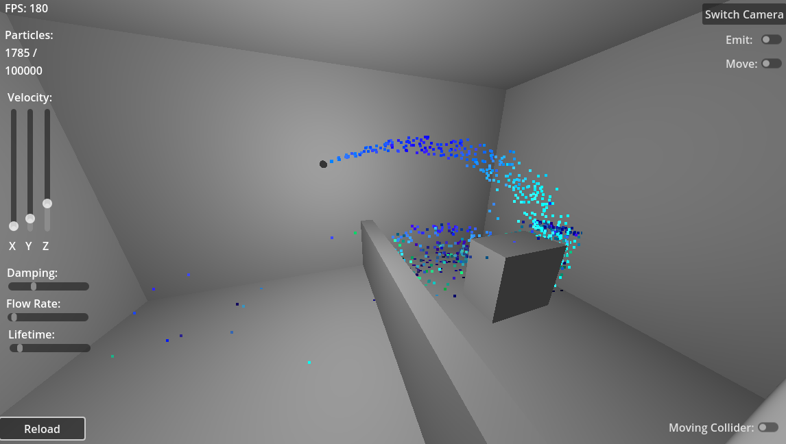

Originally developed as an exercise for UCF CAP 5727 Realistic Realtime Rendering (Fall 2025).

A Small Scale Fluid Framework for Godot 3D Forward+ projects, built with compute shaders. Designed to handle particle-particle interactions and particle-surface interactions for small bodies of fluids. Successfully renders and updates a set of over 1 million particles before experiencing slowdown (on an RTX 3080ti, Windows 11). Development still in-progress.

